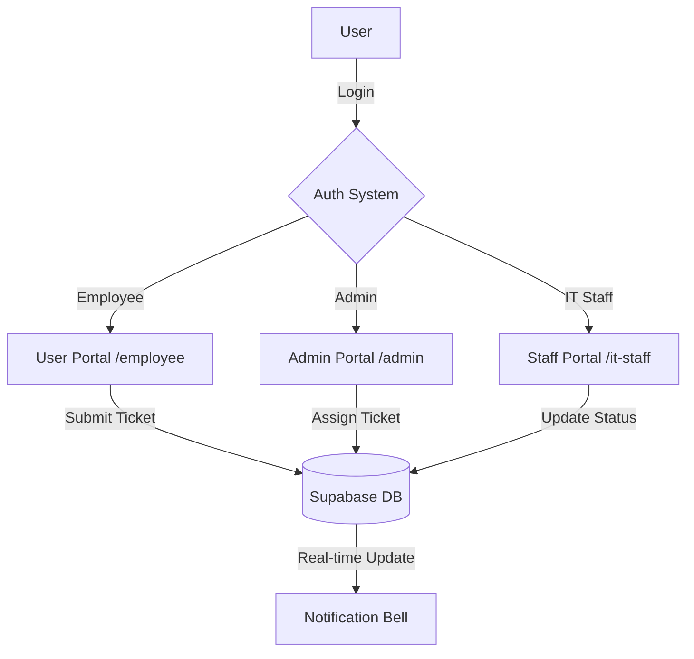

# 🏗️ IT Helpdesk System: Comprehensive Architecture Guide

Welcome to the master documentation for the **IT Helpdesk System**. This guide provides a deep dive into the system's architecture, data model, folder structure, and operational workflows.

---

## 🚀 1. Technology Stack

This system is built using modern, industry-standard web technologies:

*   **Framework**: [Next.js 14+](https://nextjs.org/) (App Router) — Handles routing, server-side rendering, and performance.
*   **Database & Auth**: [Supabase](https://supabase.com/) — A PostgreSQL-based backend that handles user authentication, data storage, and real-time updates.
*   **Styling**: [Tailwind CSS](https://tailwindcss.com/) — A utility-first CSS framework for rapid UI development.
*   **UI Components**: [Shadcn/UI](https://ui.shadcn.com/) — Radix UI-based components that are fully customizable and live inside our source code.
*   **Icons**: [Lucide React](https://lucide.dev/) — A clean and consistent icon set.

---

## 🔗 2. The Bridge: Frontend vs. Backend

Understanding where the "logic" lives is key to maintaining the system. Unlike traditional apps where everything is in one place, this system is **Decoupled**:

### 🌍 The Frontend (The "Face")
*   **Location**: Found inside the `app/` and `components/` folders.
*   **Function**: This is what the user sees in their browser. It handles the buttons, forms, tables, and the overall "look."
*   **Technology**: React, Tailwind CSS, and Next.js Client Components.

### ⚙️ The Backend (The "Brain")
The backend is split into two parts:
1.  **The Internal Backend (Next.js Server)**:
    *   **Location**: Found in `app/**/page.js` (Server Components) and `middleware.js`.
    *   **Function**: Securely fetches data, checks if you are logged in, and prepares the page before it ever reaches your browser.
2.  **The External Backend (Supabase)**:
    *   **Location**: Hosted in the cloud (Supabase.com).
    *   **Function**: This is our **Database** and **Auth Provider**. It stores all your tickets, users, and handles the security rules (Row Level Security).

### 🤝 How They Connect
The connection is forged using two "keys" found in your `.env.local`:
1.  **The Bridge Helper (`lib/supabase.js`)**: This is the library that allows the frontend to talk to the database.
2.  **API Requests**: When an employee submits a ticket, the frontend sends a "POST" request to Supabase. Supabase saves it and sends back a "Success" message.
3.  **Real-time Pings**: Supabase uses **WebSockets** (a constant open line) to ping the frontend whenever a new notification is created.

---


## 📂 3. Folder Structure & Role

The project is organized into logical blocks to separate concerns:

### `app/` (The Routing Engine)
Each folder here represents a URL path.
*   `app/page.js`: The "Switchboard." It checks your login status and role, then redirects you to `/admin`, `/it-staff`, or `/employee`.
*   `app/login/` & `app/register/`: Authentication entry points.
*   `app/admin/`: Tools for IT Managers (Manage staff, view all tickets, system metrics).
*   `app/it-staff/`: Portal for technicians (Work on assigned tickets).
*   `app/employee/`: User-facing portal (Submit and track personal tickets).

### `components/` (The UI Library)
*   `components/ui/`: Contains the **Shadcn/UI** "building blocks" (Buttons, Input fields, Tables, Dialogs).
*   `components/AdminNav.js` / `ITStaffNav.js` / `EmployeeNav.js`: Role-specific sidebar/navigation.
*   `components/NotificationBell.js`: The central hub for real-time system alerts.

### `lib/` (The Technical Core)
*   `lib/supabaseServer.js`: Handles database connections from the server (secure).
*   `lib/supabase.js`: Handles database connections from the browser (real-time).
*   `lib/notifications.js`: Logic for creating and fetching system alerts.
*   `lib/badgeHelpers.js`: Utility to automatically color-code ticket statuses and priorities.

---

## 📊 4. Database & Data Model

The system uses three primary tables in the `public` schema:

1.  **`profiles`**: Extends the default user data.
    *   `id`: Linked to the authentication system.
    *   `role`: Defines access (Admin, IT Staff, or Employee).
    *   `full_name` & `avatar_url`: User identity details.
2.  **`tickets`**: The heart of the system.
    *   `status`: (open, in_progress, resolved, closed).
    *   `priority`: (low, medium, high, urgent).
    *   `submitted_by`: Links to the Employee who made the request.
    *   `assigned_to`: Links to the IT Staff member working on it.
3.  **`notifications`**: Real-time alerts.
    *   Triggers are sent here when a ticket status changes or a new assignment is made.

---

## 🛠️ 5. How the System Works (Key Workflows)

### A. Authentication & Security
1.  **Login**: User enters credentials. Supabase validates them.
2.  **Middleman**: `middleware.js` ensures the user's session stays fresh and secure while they navigate.
3.  **Role Guard**: If an Employee tries to visit `/admin`, the system will either block the data fetch or the page itself will redirect them back to their authorized area.

### B. The Ticket Journey
1.  **Submission**: An Employee fills a form in `/employee`. A new row is created in the `tickets` table.
2.  **Assignment**: An Admin sees the "Open" ticket and assigns it to an IT Staff member (updating `assigned_to`).
3.  **Resolution**: The IT Staff member updates the ticket status to "In Progress" and eventually "Resolved."
4.  **Feedback**: The Employee is notified via the `NotificationBell` of every status change.

### C. Real-Time Logic
When the database changes (e.g., a ticket is resolved), Supabase sends a "Ping" to the website. The `NotificationBell` component listens for these pings and updates the UI instantly without the user needing to refresh the page.

---

## ✨ 6. Design Philosophy

*   **Dark Mode**: The system uses a "Zinc" dark theme for a professional, dashboard-like feel.
*   **Accessibility**: All components are built using Radix UI primitives, ensuring they work well with keyboards and screen readers.
*   **Responsiveness**: The layout adjusts for mobile phones, tablets, and desktop monitors.

---

## 🚀 7. Maintenance & Development

*   **Adding a Page**: Create a new folder in `app/` and add a `page.js`.
*   **Changing Styles**: Edit `app/globals.css` for global styles, or use Tailwind classes directly in components.
*   **Extending Data**: Update the tables in the Supabase Dashboard, then update the logic in the corresponding `page.js`.

---

## 🚦 8. Getting Started Locally

To run this project on your machine, follow these steps:

1.  **Clone the Repository**: Ensure you have all the files locally.
2.  **Install Dependencies**:
    ```bash
    npm install
    ```
3.  **Setup Environment Variables**:
    Create a `.env.local` file in the root directory and add your Supabase credentials:
    ```env
    NEXT_PUBLIC_SUPABASE_URL=your_supabase_url
    NEXT_PUBLIC_SUPABASE_ANON_KEY=your_supabase_anon_key
    ```
4.  **Run Development Server**:
    ```bash
    npm run dev
    ```
    The app will be available at [http://localhost:3000](http://localhost:3000).

---

## 🗺️ 9. System Flow (Visual)



---

## 🔒 10. Roles & Permissions Matrix

| Feature | Admin | IT Staff | Employee |
| :--- | :---: | :---: | :---: |
| Submit Tickets | ✅ | ✅ | ✅ |
| View Own Tickets | ✅ | ✅ | ✅ |
| View ALL Tickets | ✅ | ❌ | ❌ |
| Assign Tickets | ✅ | ❌ | ❌ |
| Update Status | ✅ | ✅ (Assigned) | ❌ |
| Manage Staff | ✅ | ❌ | ❌ |
| System Settings | ✅ | ❌ | ❌ |

---

## 🧼 11. Clean Code & Standards

*   **Components**: Always use functional components with `hooks`.
*   **Data Fetching**: Prefer **Server Components** for initial data loading to improve SEO and speed. Use **Client Components** only when interactivity (like forms or real-time listeners) is needed.
*   **UI Consistency**: Use the `Badge` and `Button` components from `@/components/ui` instead of raw HTML elements.
*   **Safety**: All database queries should go through the `lib/supabaseServer.js` helper when on the server to ensure environment variables are used correctly.

---

> [!NOTE]
> This document is a living guide. Whenever you add a major feature or change the database schema, please update the corresponding section here.
